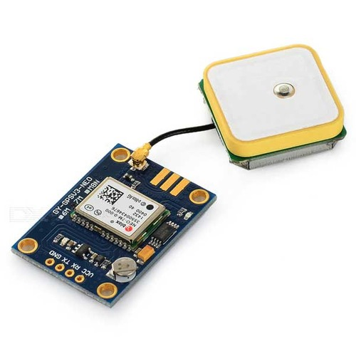
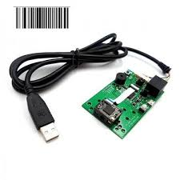
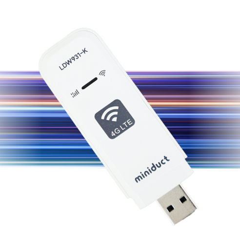
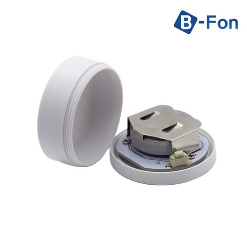
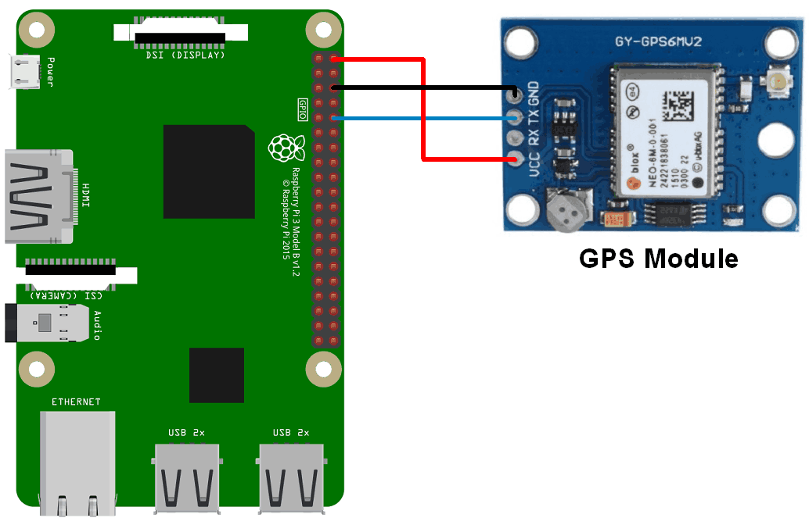

# 사용 부품

1. 라즈베리파이 모델 4 8GB


2. 라즈베리파이 공식 터치 lcd


3. NEO-7M 아두이노 GPS 수신모듈



4. DE2110 바코드 스캐너



5. USB LTE 라우터



6. IBeacon 비콘



# 회로 결선



그 외에 `USB LTE 라우터`와 `QR 스캐너`는 USB 에 `7인치 터치 디스플레이는` 케이블을 사용하여 연결 해주세요.

# 센서 설정

먼저 운영체제는 `라즈비안` 을 설치해주세요.

그후 라즈비안 데스크탑에서 `Preferences` -> `Raspberry Pi Configuration` -> `Interfaces` 의 `Serial Port` 를 `Enable`, `Serial Console` 을 `Disable` 로 설정 합니다.

재부팅 해주세요 `sudo reboot now`

`sudo raspi-config` 로 설정을 열고 `Interface Options` -> `Serial Port Enable/Disable` 을 선택해주세요.

`login shell to be accesible over serial` 은 `NO` , `serial port hardware to be enabled` 는 `YES`로 설정해주세요. 

그 후 `/boot/firmware/config.txt` 의 `[all]` 밑에 아래 내용을 추가후 재부팅 해줍니다.


```
enable_uart=1
dtoverlay=uart5
```

재부팅 후 shell 에서 아래 명령어를 통해 의존성을 설치해주세요.

```
sudo apt-get update
sudo apt-get full-upgrade 
sudo apt-get install python3-pip 
sudo pip install pip —upgrade 
sudo pip3 install pyserial
sudo pip3 install pynmea2 
sudo apt-get install gpsd gpsd-clients 
```

`/etc/default/gpsd` 파일을 아래 값을 추가 해줍시다.

```
START_DAEMON = "true"
DEVICES = "/dev/serial0"
GPSD_OPTIONS = "-F /var/run/gpsd.sock"
```

# 실행
`device` 폴더로 가서 아래 명령어를 타이핑 해주세요.

`pip install -r requirements.txt`

그 후 `python run_one.py` 파일을 실행해주시면 됩니다.